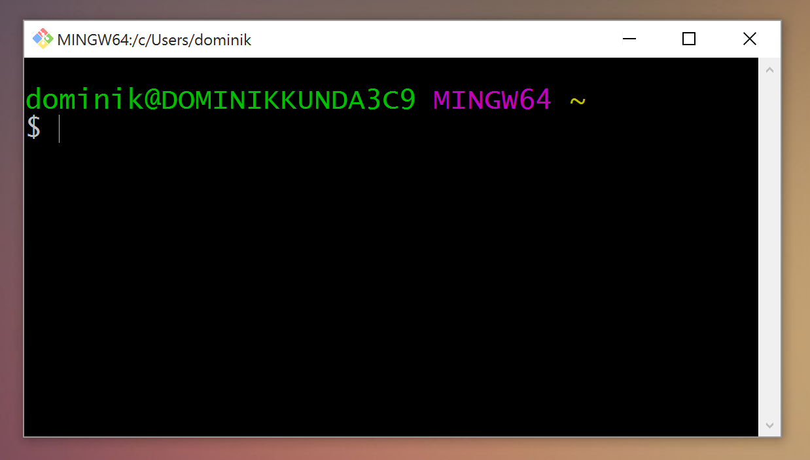
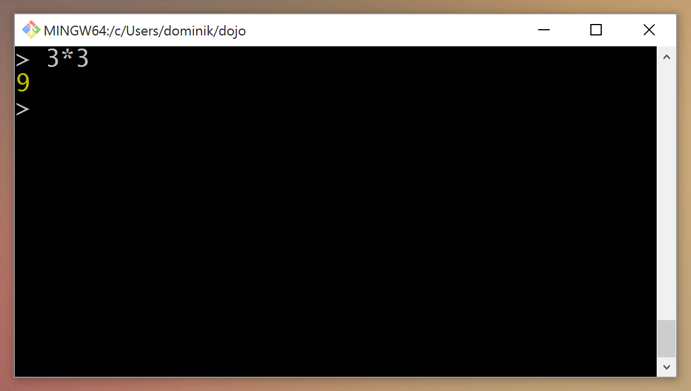
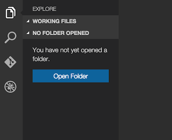
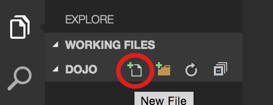

# Learning Node.JS [Session 1 - Setup and JavaScript basics]

## What you will learn in this session:

> - How to create a folder in the command prompt and run a program
> - What an object, a variable, a loop and an array is
> - How to use a function and print your first message to the screen

## Installing Software

Over the next weeks we will dive into learning how to code a JavaScript project using Node.JS. For that we need to install some software to get started. Contrary to the JavaScript that we wrote before, these programs will not execute in your browser but directly on your computer. For now we will install three different things. We will need a code editor in which we will be doing the programming, an interpreter in this case called **Node.JS** that will understand the code and exectute our program and then we will install a program called **Git**. 

#### 1. Visual Studio Code as your new code editor

You could write your code in any plain text editor such as Notepad but programmers prefer having more ellaborate special code editors that will help them during daily tasks. There are plenty on the market but in our case we will use **Visual Studio Code**. You can download it by going to

https://code.visualstudio.com/

And clicking on the *Download Code* button. Once you downloaded the file, execute it and install the editor. If it asks you whether you want to add an entry to the context menu say yes. Once done you should be able to see on your Desktop this logo:


#### 2. Node.JS as your JavaScript engine

JavaScript was originally a programming language for the web. However with Node.JS programmers got the possibility to run JavaScript programs without being in a browser. We need to install **Node.JS** on our computers before we can run any of our code. For this go to

https://nodejs.org/en/

and download the *Stable* version. Just execute the downloaded installer and go through all the steps. Once it's done don't be confused it will not create any visible program entry. We will check later if it works. 

#### 3. Git

This is the last thing we need for now. Git is what we call a **version control system**. It allows you to track changes in your document and revert unwanted changes. We will learn more about it later. But for now we will install it because some things have dependencies on it and we want to use the command prompt that is being installed with it. To install it head to:

https://git-scm.com/downloads

Download there the respective version depending on your Operating System and walk through the installer. 

## Command Prompt

In this tutorial we will mainly focus on Windows as an Operating System but all things will be able to run on Mac OS or any Linux just as well.

Programmers use the command prompt for a lot of tasks in their daily life. It allows you to get a lot of tasks done very efficiently. Every operating system has some sort of command prompt or also called 'shell'. There are a variety of them. Windows comes with two built-in command prompts. Additionally we got another one called **Git Bash** when we installed Git. For the next sessions we will use this prompt to run all the commands. Once you open the application you will see a black window like the one in the pictue below.



In here we can execute now a variety of commands but first let's understand what this is actually showing. We can see four different sections if we differentiate by color. 

The green colored part is your username and machine name. We will ignore the purple part for now, it isn't interesting for what we will do. The yellow text that is in the beginning only a `~` shows the current directory/folder we are operating in. The `~` is a shorthand notation for your home directory which will be typically in Windows something like  `C:/Users/myname`. 

The last thing is the line that starts with a `$`. This is the part where you can write your commands. There are a variety of commands built-in. We will use a couple of them to do some basic things.

The first thing we want to do is creating a folder called `dojo`. For that we will use the `mkdir` command. `mkdir` stands for *Make directory* and creates the folder that you will write as the second word. Therefore your first line should look like this:

``` 
$ mkdir dojo
```

Once you press `Enter` the folder will be created. The next thing we need to do is to navigate to that folder we just created. For this we can use the *Change directory* tool called `cd`. Simply type:

``` 
$ cd dojo
```

You will see that the yellow part has now been updated to `~/dojo`. This indicates that we successfully navigated to that directory. If we want to see the folder we can use the `start` command of Windows to open the folder in the Explorer. Since we are already in the directory we want to open we can use `.` to denote that we want to open the current directory.

``` 
$ start .
```

The last thing we will do for now is to check if *Node.js* is successfully installed. For this we will have to write the `node` command. This will open the *Node.js* shell where we can write JavaScript. If you type `node` and press `Enter` it will clear the screen and replace the `$` by `>`. From that point on we can write JavaScript. Just type `3*3` to see if it works.



In order to leave this mode again you need to press `Ctrl`+`C` twice or type `.exit`. After that you will be back in the normal command prompt.

> #### What you learned in this section
> 
> 1. A command prompt allows you to be more productive
> 2. You can create a folder by using `mkdir` and navigate to a folder using `cd`
> 3. By writing `node` you can start writing JavaScript. By pressing `Ctrl`+`C` you will be able to exit the prompt.
> 4. Writing `node filename.js` you can execute a file with a program
> 5. By pressing the up arrow you can get the previous command to rerun it.

## The Code Editor

In theory you could write all the programs we will be writing in the next sessions using a basic plain text editor such as Notepad. However programmers prefer using either special code editors or a so called IDE. IDEs are more heavy programs that allow you to do a lot of additional tasks that come with programming that are not directly writing the code. Code editors on the other hand try to be lightweight and focus on helping you write the code. Both types of editors usally provide you with a certain set of standard features.

One important feature is syntax highlighting. The editor will color different parts of the code in other colors to let you read the code more easily and understand the structure better. It also helps you to spot mistakes more easily.

The other important feature is autocomplete. The editor will constantly try guess what you are intending to do and suggest different things that you might be intending to write. For example if you are in JavaScript and you write `console.` it will suggest you a variety of available methods you can call. You can navigate using the arrow keys and press enter to select this and the editor will input the code. If you do not intend to use the feature you can just continue typing.

The code editor that we will use for this project is called **Visual Studio Code**. The first thing we need to do is open the editor if it is not open yet and open the folder we created in the command prompt. For this click on the blue *Open Folder* button and navigate to the `dojo` folder we created. 



Once you opened the `dojo` folder hover on the left over the `dojo` text and click the new file button as highlighted on the picture. We will call our file `app.js`. The ending `.js` indicates that this is a JavaScript file. It will help the code editor to do an assumption which programming language we are using.



That's it! We have now our first file and are ready to finally write our first line of code!

> #### What you learned in this section
> 
> 1. Code editor provide you with syntax highlighting that allows you to read code more easily
> 2. Most editors come with suggestions and autocomplete functionality

## Hello World!

When a programmer learns a new programming language the classical first program he or she writes is called 'Hello World!'. The whole purpose of the program is to print `Hello World!` to the screen. In our case the new language is JavaScript and we want to print `Hello World!` to the command prompt, also called `console`.

In programming two terms you usually interact with are **Objects** and **Functions**. Just like in real life you can interact with objects. Objects can have properties and actions to interact with them. These actions are known as methods. Methods are a kind of function.

A function is a block of code that can be executed on demand and can receive arguments that will influence the execution of the block of code. We will cover how to write a function or method in a later session. In this session we will only use methods to interact with different objects.

Our goal is still to print `Hello World!` to the console. In the case of JavaScript we can achieve this by calling the `log` method on the `console` object. The `log` method receives an argument which is the text that we want to print. A text in programming is always wrapped in quotes. In modern JavaScript these can be three different types of quotes: ``"``, ``'`` or **`**. A text wrapped in any of these quotes is called a **String**. In our examples we will use for now the single quotes.

Knowing all of this we can write our first line of code into the `app.js` file. The code should look like this:

``` javascript
console.log('Hello World!');
```

If you want to print other texts you can change the text between the quotes and if you want to print several messages you can just copy the code onto multiple lines. 

In order to run this you need to go back into your command prompt window and type `node app.js` and press `Enter`.

> #### What you learned in this section
> 
> 1. Functions allow you to execute a block of code that might have different behaviors based on arguments passed to it.
> 2. Programming is all about interacting with objects. You can pass objects to functions, access properties or interact with them using methods.
> 3. Methods are a special kind of functions that interact with the respective property.
> 4. To print something to the console we can call the `log` method on the `console` object.
> 5. An actual text in code is wrapped into quotes that can be: **"**, **'** or **`**.

## Variables and Loops

**Variables** and **Loops** are two of the most important concepts in programming. Both concepts allow you to write less code and achieve more. Loops allow you to execute a snippet of code as long as a certain condition is met. Variables on the other hand allow you to store a value under a nickname and reuse it across your code. Imagine a variable like a box with a label. You can decide the name on the label and you can look into the box to see what's in there or replace the item with a new one.

Let's start with learning how to create and use a variable. You declare a new variable by writing `var` followed by the name for your new variable. If you want to assign a value to a variable you specify the name, write an `=` and then specify the value you want to set it to. If you want to use the variable somewhere just write the name of it.

``` javascript
var index; // declare a variable
index = 0; // give it a value
console.log(index); // output the value to the console
```

Most programming languages support a variety of loops. We will learn more loops in the future but for now we will use a `for` loop. The general structure of a `for` loop is the following:

``` javascript
for(/* (1) setup */; /* (2) continuation condition */; /* (4) step execution */) {
  /* (3) code that should be executed every iteration */
}
```

As you can see there are four gaps that we need to fill out with some code. In order to be able to fill the gaps we first need to understand in which order these are executed. The idea of a loop is that it executes until a certain condition is met. In a `for` loop this condition can be met by two things. The common scenario is that the loop stops as soon as the condition in `(2)` is equal to `false`. In case anything is going wrong in the mean time we still have the option to call `break;` and stop the loop from continuing. The general order of the execution of the different steps is hinted with the numbers but let's explain it further.

1. This part of the loop is the setup and is only executed once in the beginning. This part allows you to set an initial condition like a counter.
2. Before every round this condition is checked. If the condition is `true` we will execute `(3)`, else we will just stop with executing the loop. Here we can for example check the value of the counter created in `(1)`.
3. This is where you want to put your actual code. Everything that is between the `{}` will be executed once per iteration.
4. After every round this step is executed. This is part we can use for incrementing the counter that we created in `(1)` and are checking in `(2)`.

Now that we learned what variables and loops are, we can make use of these to print a message multiple times to the screen. Let's say we want to print `Hello Dojo!` in total five times to the screen. We can use a `for` loop for this where we create in `(1)` a counter variable set to `0`. In `(2)` we will check if it is smaller than `5`. In `(3)` we will use `console.log` and in `(4)` we will increment the counter by one. The code in your `app.js` should look like this:

``` javascript
console.log('Hello World!');

for(var index = 0; index < 5; index++) {
  console.log('Hello Dojo!');
}
```

> #### What you learned in this section
> 
> 1. A variable lets you store a value under a nickname and reference it later
> 2. There are a variety of loops
> 3. A `for` loop has 4 different sections. A setup stage, a continuation condition, a body and a post-round stage.

## Arrays

We successfully managed to print a message multiple times to the screen. But this alone is not really interesting and doesn't really highlight one of the main purposes of using a loop. Where loops become interesting is when we perform actions inside the body that vary based on in which iteration we are in. One of the most common things to do with a loop is to iterate over a list of items. Different programming languages might have different types of lists but the list that we are going to use in JavaScript is called `Array`. 

An array always starts with `[` and ends with `]`. In between that you can have various items that are separated by commas. Knowing that we can create a variable called `participants` that is a list of names of people participating in our dojo.

``` javascript
var participants = ['Dominik', 'Philip'];
```

Now that we have this list of participants we can modify our existing loop code to actually greet everyone in the dojo inidividually. The first thing we need do is to update the `Hello Dojo!` to print the name of the respective participant. For this we need to access the different elements in the list. You access an element in an array by writing the name of the array followed by `[index]` where index is the position of the element you want to get. In programming we start counting at `0` therefore the first element has position `0`. So if we want to get `Dominik` we need to write: `participants[0]`. The other thing we need to do is to change the quotes `'` to **`**. This changes the text to a **template string** which allows us to write JavaScript inside the string. The JavaScript inside needs to be wrapped in `${…}` in order to be noticed as JavaScript. Knowing all of that we can edit our code:

``` javascript
console.log('Hello World!');

var participants = ['Dominik', 'Philip'];

for(var index = 0; index < 5; index++) {
  console.log(`Hello ${participants[index]}!`);
}
```

If we run this program you will see an output that looks like this:

``` 
Hello World!
Hello Dominik!
Hello Philip!
Hello undefined!
Hello undefined!
Hello undefined!
```

That's because we try to access elements at the position 2, 3 and 4 but we only have elements in position 1 and 2. To fix this we need to stop the loop at the end of the list. We can do this by accessing the `length` property of the array and change the continue condition to break at that value. The result will be the following:

``` javascript
console.log('Hello World!');

var participants = ['Dominik', 'Philip'];

for(var index = 0; index < participants.length; index++) {
  console.log(`Hello ${participants[index]}!`);
}
```

> #### What you learned in this section
> 
> 1. An array is a list of items that are separated by comma and delimited by `[]`.
> 2. Loops are useful to easily go over items in an array.
> 3. The `length` property on an array lets you know the size of the list.

## Maths

One of the things programming is useful for is doing mathematical calculations. JavaScript has a built in object for this called `Math` that we can use to do all kind of cool things. We can use it to compute 4 to the power of 50 is by simply writing `Math.pow(4, 50)` or do other operations on numbers such as finding the absolute value of a number.

Let's use this library to actually add to our small program a part where every participant gets a random number that has been rolled via a programmed dice. For this we need to generate random numbers between 1 and 6. In order to do this, we first need to do a bit of math ourselves. 

First let's get a random number. JavaScript has a built-in generator for random numbers. We can use it by writing `Math.random()`. This will give us a number between 0 and 1 with a bunch of decimals. We now need to get this number to be actually between 1 and 6. For that we need to first multiply the number we get fom `Math.random()` by 6. This will give us random numbers between 0 and 6. Now we need to actually get the floor of this number which will result us getting a number that is one of the following 0, 1, 2, 3, 4 or 5. Which is close to what we need. The last thing we then need to do is to add 1 to it and output it in our program. As a result our `app.js` should look like this:

``` javascript
console.log('Hello World!');

var participants = ['Dominik', 'Philip'];

for(var index = 0; index < participants.length; index++) {
  var dice = Math.floor(Math.random() * 6) + 1;
  console.log(`Hello ${participants[index]}! Your dice throw: ${dice}`);
}
```

> #### What you learned in this section
> 
> 1. You can use the `Math` object to perform more complex math calculations
> 2. Using `Math.random()` you can create all kinds of random numbers


## Conclusion

This was a bunch of things to take in for the first session. If you have any questions you can always ping me via Twitter. Just tweet to [@dkundel](http://twitter.com/dkundel).


